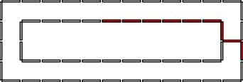

# GCurve

Let C the digital boundary, i.e. a sequence of grid-edges 
(linels), of some digital shape D. 

Let C+ the digital boundary of D+, the dilation of D 
by a square of side 1.

A g-glued curve is a digital curve of length g+1, in which 
1 linel come from C and g linels come from C+. The 
segments of C and C+ are connected by two junction linels .

This library creates g-glued curves and iterates over 
its linels.



# Dependencies

1. [libboost1.66.0-dev](https://www.boost.org/users/history/version_1_66_0.html)
2. [opencv-3.3.0](https://opencv.org/releases.html)
3. [eigen-3.36](http://eigen.tuxfamily.org/index.php?title=Main_Page)
4. [DGtal0.9](https://dgtal.org/download/)

# Build and install

```
mkdir build
cd build
cmake ..    
make install
```
  
# Use

Check some code examples in lab/examples

