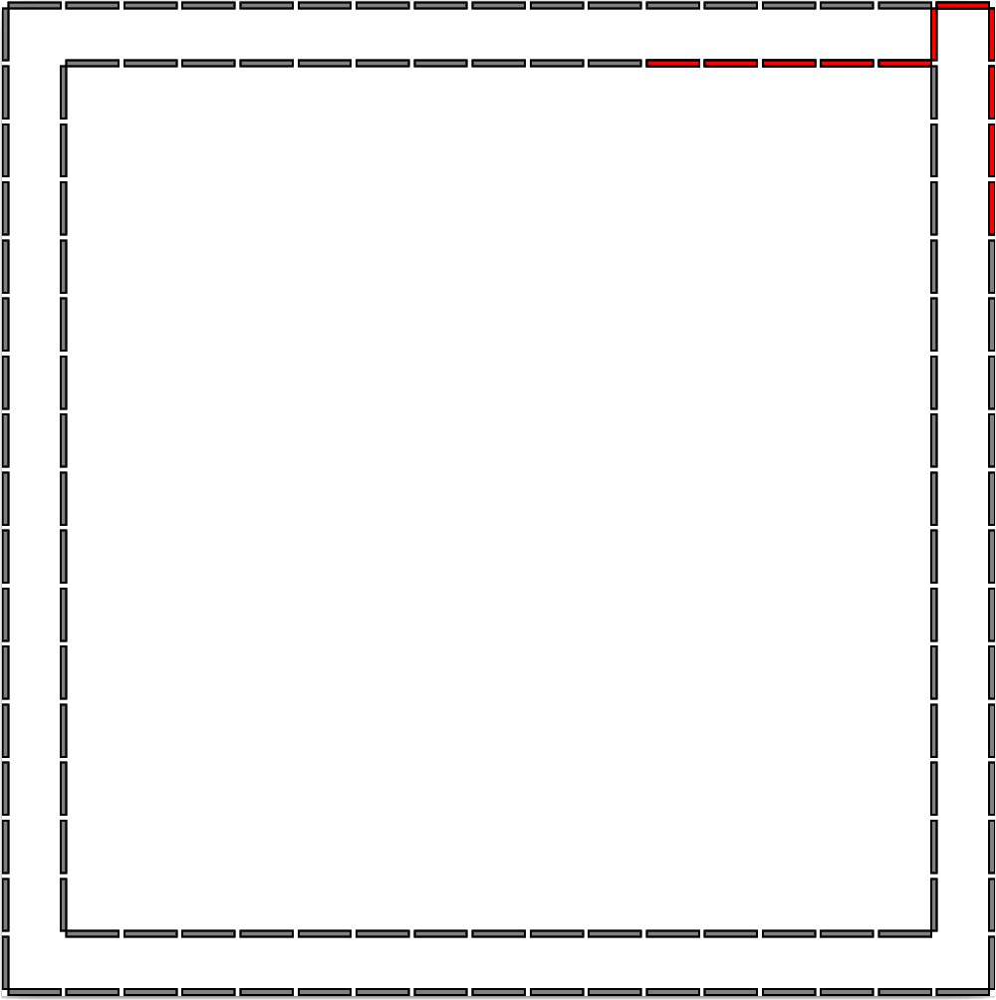

# Description

Let C the digital boundary, i.e. a sequence of grid-edges (linels), of some digital shape D. 

Let C+ the digital boundary of D+, the dilation of D by a square of side 1

A g-glued curve is a digital curve of length 2g+1, in which g linels are from C and g linels are from C+. 

The remaining grid-edge, called joint linel, connects the segments of C and C+.

This library creates g-glued curves and iterates over its linels.



# Dependencies

[DGtal 0.9](https://dgtal.org/)

[Boost 1.66](https://www.boost.org/)

[DIPaCUS](https://github.com/danoan/DIPaCUS)

# Building

```
mkdir build
cd build
cmake ..    
make 
```
If the procedure does not work, its likely that some build variable is missing or unproperly set. 
Type ccmake .. to configure the build variables and then try to execute make again.    

# Use

Check the two code examples in the examples directory.

